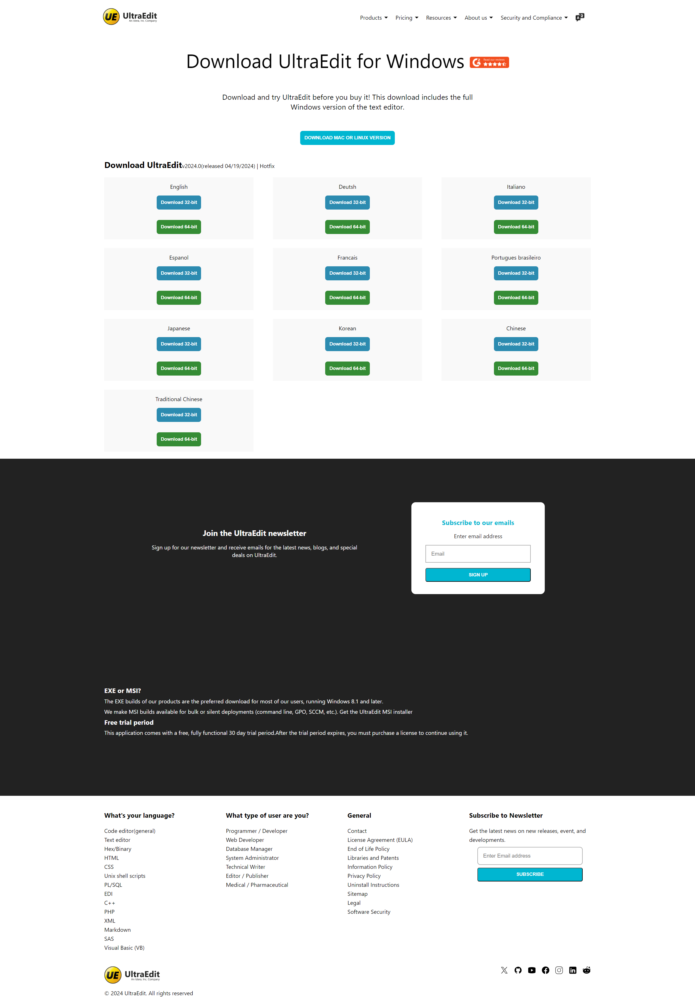

# UltraEdit Clone

# Overview
This project is a clone of the UltraEdit website, created using only HTML and CSS. UltraEdit is a pioneer in text editing software with a comprehensive suite of products catering to individual programmers, startups, large enterprises, and corporations. The clone aims to mimic the design and layout of the original UltraEdit website to provide a similar user experience.

# Preview



# Features of the Clone
1. HTML and CSS Only: The clone is built entirely with HTML and CSS, without any JavaScript or backend technologies.
2. Responsive Design: The website is designed to be responsive and looks good on various devices.
3. Mimics UltraEdit Design: The design and layout closely follow the original UltraEdit website to provide a similar look and feel.

# Live Demo
You can view the live version of the UltraEdit clone [here](https://ultra-edit-clone-psi.vercel.app/)

# Repository
The code for this project is available on GitHub. You can find the repository [here](https://github.com/adity3902/UltraEdit).

# Author
This project was created by Aditya Singh. If you have any questions or feedback, feel free to contact me via GitHub.

# Installation
To run the project locally, follow these steps:

1. Clone the repository:
```bash
git clone https://github.com/adity3902/UltraEdit.git
```
2. Navigate to the project directory:
```bash
cd UltraEdit
```
3. Open index.html in your browser to view the website.


Feel free to contribute to the project by creating issues or submitting pull requests. Any contributions are welcome!

Thank you for checking out the UltraEdit clone!
